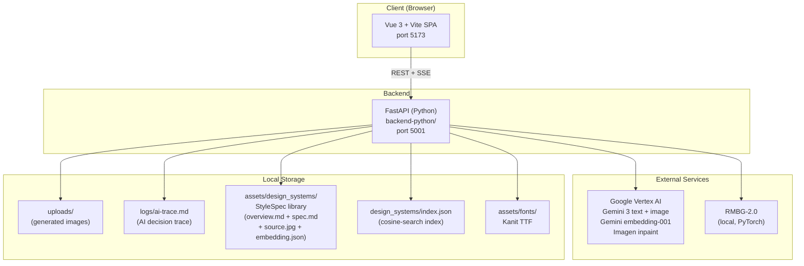
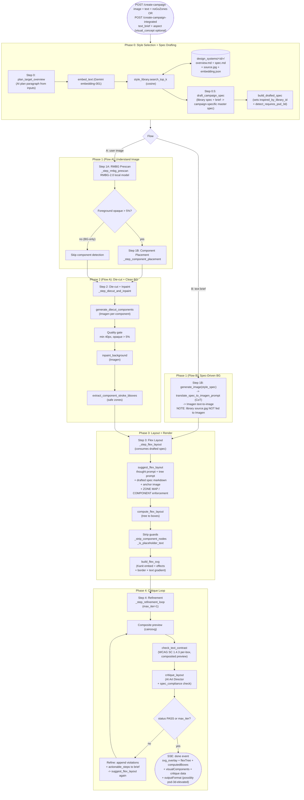
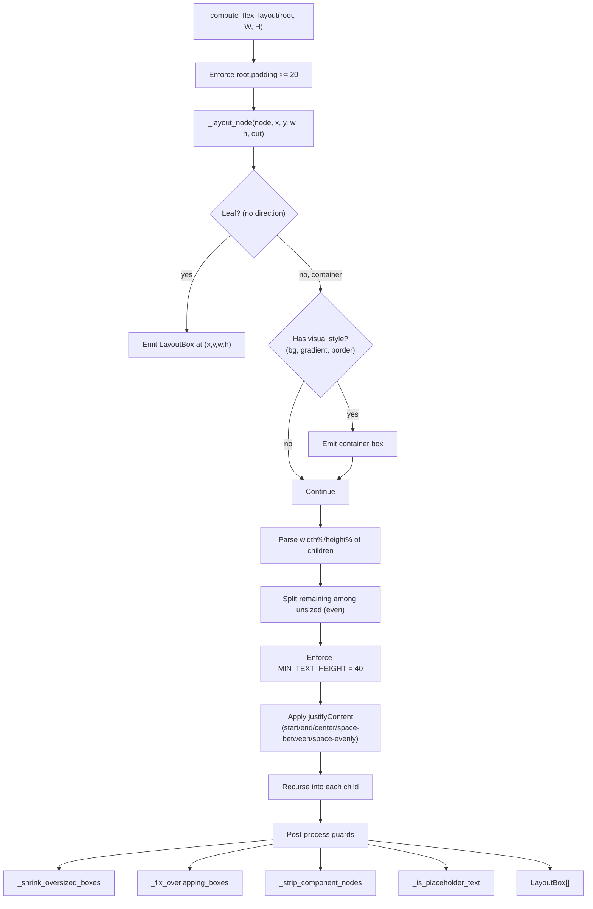
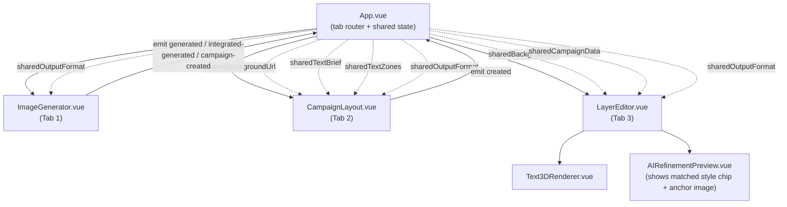
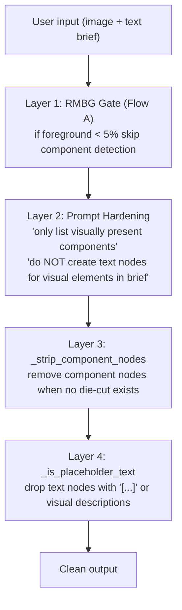
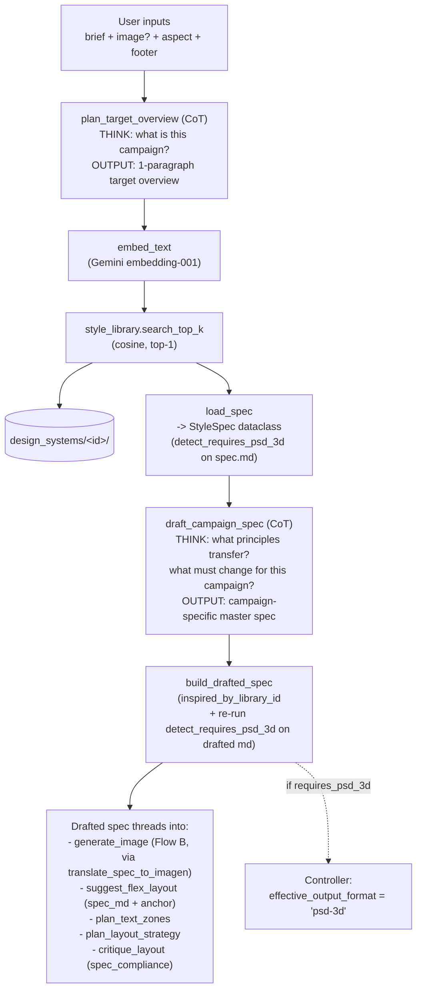

# Architecture — gen-image-layer-separator

Detailed reference covering the system overview, file layout, and every workflow.
Use this as the onboarding / debugging / extension guide.

---

## 1. High-Level Overview

An **AI-powered image layer separator + ad campaign generator** centered on a
**StyleSpec pipeline**: a human-curated library of design-system specs provides
the inspiration layer, an AI drafts a **campaign-specific master spec** from
that inspiration, and the drafted spec becomes the **single source of truth**
that drives every downstream step (background generation, flex layout, critique,
text-zone planning).

Google Vertex AI (Gemini 3) is the AI core, RMBG-2.0 handles background
removal in Flow A, and the main pipeline streams results over SSE.



**Key boundaries**
- Frontend never calls Vertex directly — every AI call goes through FastAPI.
- RMBG runs in-process (singleton, warmed up on startup). Flow B (text-brief-only
  campaign) no longer uses RMBG — the drafted spec drives background generation.
- StyleSpec library index is loaded once at FastAPI startup via the lifespan hook.

---

## 2. Module Map

```mermaid
graph TB
  Root["gen-image-layer-separator/"]
  Root --> FE["frontend/"]
  Root --> BP["backend-python/"]
  Root --> SCR["scripts/<br/>rebuild_index.py"]

  FE --> FEApp["src/App.vue<br/>(tab router + shared state)"]
  FE --> FECmp["src/components/"]
  FECmp --> FEIG["ImageGenerator.vue"]
  FECmp --> FECL["CampaignLayout.vue"]
  FECmp --> FELE["LayerEditor.vue"]
  FECmp --> FEARP["AIRefinementPreview.vue"]
  FECmp --> FE3D["Text3DRenderer.vue"]

  BP --> BPApp["app/"]
  BP --> BPAs["assets/design_systems/<br/>StyleSpec library"]
  BPApp --> BPMain["main.py (FastAPI entry<br/>+ lifespan style-library load)"]
  BPApp --> BPRt["routes/image.py"]
  BPApp --> BPCtl["controllers/image.py<br/>(SSE orchestration)"]
  BPApp --> BPSvc["services/"]
  BPSvc --> BPVx["vertex.py (AI client)"]
  BPSvc --> BPSL["style_library.py<br/>(cosine index + top-k)"]
  BPApp --> BPPr["prompts/<br/>(AI prompt templates)"]
  BPApp --> BPUt["utils/"]
  BPApp --> BPCo["constants/"]

  BPPr --> P1["campaign_layout.py"]
  BPPr --> P2["flex_layout.py"]
  BPPr --> P3["critique.py"]
  BPPr --> P4["diecut.py"]
  BPPr --> P5["layout_strategy.py"]
  BPPr --> P6["render_campaign.py"]
  BPPr --> P7["separate_layers.py"]
  BPPr --> P8["describe.py"]
  BPPr --> P9["text_zone_planner.py"]
  BPPr --> P10["plan_target_overview.py (CoT)"]
  BPPr --> P11["draft_campaign_spec.py (CoT)"]
  BPPr --> P12["translate_spec_to_imagen.py (CoT)"]
  BPPr --> P13["extract_style_spec.py"]

  BPUt --> U1["flex_layout.py<br/>(tree to boxes)"]
  BPUt --> U2["svg_builder.py<br/>(boxes to SVG)"]
  BPUt --> U3["text_measure.py"]
  BPUt --> U4["text_warp.py"]
  BPUt --> U5["safe_zones.py"]
  BPUt --> U6["style_spec.py<br/>(StyleSpec dataclass + loader)"]
  BPUt --> U7["contrast.py"]
  BPUt --> U8["brightness_map.py"]
  BPUt --> U9["ai_logger.py<br/>(trace + extract_output_block)"]
```



---

## 3. API Surface

Endpoints are registered in `backend-python/app/routes/image.py`
and implemented in `backend-python/app/controllers/image.py`.

### 3.1 REST Endpoints

| Method | Path | Purpose | Key Output |
|---|---|---|---|
| POST | `/process` | Analyze components + separate text layers from an image | `{ textLayers, visualComponents, backgroundDescription }` |
| POST | `/generate` | Text-to-image (Imagen), optional reference images | `{ imageUrl, text, prompt, layers }` |
| POST | `/add-text` | Suggest campaign layout (no render) | `{ suggestions, components, ... }` |
| POST | `/render-text` | Composite text suggestions onto an image (accepts `target_width` + `target_height` for aspect preservation) | `{ imageUrl }` |
| POST | `/generate-integrated` | Plan text zones + generate background (integrated flow) | `{ imageUrl, textZones, bgConstraints }` |
| POST | `/warp-preview` | Preview a text warp effect | `{ svg, width, height }` |
| POST | `/export-svg` | Export SVG: embed fonts or convert to paths | SVG file |

### 3.2 SSE Endpoints (streaming)

| Method | Path | Purpose |
|---|---|---|
| POST | `/create-campaign` | Full pipeline from a user-uploaded image (Flow A) |
| POST | `/create-campaign-integrated` | Full pipeline with background generated from a text brief (Flow B). `visual_concept` is optional; `text_brief` is required. |

**SSE events emitted** (details in section 5):

Core pipeline: `progress`, `inpaint_mask`, `inpaint_iteration`, `background_ready`,
`debug`, `debug_preview`, `iteration_start`, `iteration_end`,
`critique_complete`, `refining`, `done`, `error`.

Phase 0 / StyleSpec events:
- `style_planning` — progress marker for Step 0 plan
- `spec_drafting` — progress marker for Step 0.5 drafting
- `style_selection` — emitted after cosine top-1 match (or when no library)
- `drafted_spec` — debug event carrying the full drafted spec markdown
- `style_spec` — debug event carrying matched library id + overview + anchor image URL
- `style_format_override` — emitted when drafted spec auto-elevates `outputFormat` to `psd-3d`

---

## 4. Backend Module Responsibilities

### 4.1 `services/vertex.py` — AI client layer

| Method | Purpose |
|---|---|
| `generate_image()` | Text-to-image via Gemini/Imagen. Accepts `style_spec` (when present it calls `translate_spec_to_imagen_prompt` internally). **Does NOT pass library `source.jpg` as an Imagen reference** — avoids source-ad copy. |
| `render_campaign_image()` | Composite text suggestions onto an image |
| `plan_layout_strategy()` | Plan layout concept (consumes drafted spec as source of truth) |
| `plan_target_overview()` | Step 0: AI plan paragraph from brief + image? + aspect + footer. Uses `get_text_model_pro()` for heavy thinking. CoT. |
| `draft_campaign_spec()` | Step 0.5: convert library spec + user brief into a campaign-specific master spec. Uses `get_text_model_pro()`. CoT. |
| `translate_spec_to_imagen_prompt()` | Translate drafted spec into Imagen prompt. CoT. |
| `embed_text()` | Gemini `embedding-001` vector (used for cosine search in Step 0) |
| `suggest_campaign_layout()` | Detect components + suggest placement |
| `critique_layout()` | Art Director judge; now emits `spec_compliance: {pass, violations}` |
| `separate_layers()` | Detect text layers in an image |
| `analyze_components()` | Detect visual components |
| `generate_diecut_components()` | Imagen per-component cutout with quality gate |
| `inpaint_background()` | Remove foreground + inpaint background (Imagen) |
| `run_rmbg_and_get_bboxes()` | RMBG-2.0 alpha mask + foreground bboxes (Flow A only) |
| `extract_component_stroke_bboxes()` | Safe zones around die-cuts |
| `export_svg()` | Embed fonts / convert to paths |
| `suggest_flex_layout()` | Generate flex tree. Consumes `style_spec_md`, enforces ZONE MAP + COMPONENT PATTERN as hard constraints. Two-stage (thought → tree). |
| `plan_text_zones()` | Pre-validated zones (integrated flow); consumes drafted spec when provided. |

Every call is wrapped in `with_retry()` (3 retries, exp backoff from 2s, handles 429 + timeout).

The three CoT methods (`plan_target_overview`, `draft_campaign_spec`,
`translate_spec_to_imagen_prompt`) log the **full** response (`## THINK` +
`## OUTPUT`) via `trace_ai`, then call `extract_output_block()` so downstream
consumers see only the clean OUTPUT section.

### 4.2 `services/style_library.py` — In-memory spec index

- Loads `design_systems/index.json` once at FastAPI startup via `main.py` lifespan.
- `load_index(base_dir)` — read + cache entries.
- `search_top_k(query_vector, k=STYLE_SPEC_TOP_K)` — cosine similarity against cached embeddings.
- Graceful no-op when the library directory or index is missing; the pipeline logs `No style library` and continues without StyleSpec.

### 4.3 `prompts/` — AI prompt templates

Rules (per CLAUDE.md):
- **Always generic** — never include image-specific content.
- **Universal rules** — rules must be design principles applicable to any image.
- **AI must decide** — no lookup tables.

| File | Exports | Notes |
|---|---|---|
| `campaign_layout.py` | `build_campaign_layout_prompt(...)` | Accepts `style_hint` from StyleSpec overview |
| `flex_layout.py` | `build_flex_thought_prompt(...)`, `build_flex_tree_prompt(...)` | Consumes `style_spec_md`. ZONE MAP ENFORCEMENT + COMPONENT PATTERN EMISSION hard constraints. Supports `borderWidth` / `borderColor` / `textGradient` styles. |
| `critique.py` | `build_critique_prompt(...)` | Output schema now includes `spec_compliance: {pass, violations}` |
| `diecut.py` | `build_diecut_prompt(...)` | |
| `layout_strategy.py` | `build_layout_strategy_prompt(...)` | Accepts drafted spec as source of truth |
| `render_campaign.py` | `build_render_prompt(...)` | |
| `separate_layers.py` | `build_separate_layers_prompt(...)`, `build_analyze_components_prompt()` | |
| `describe.py` | `DESCRIBE_PROMPT` | |
| `text_zone_planner.py` | `build_text_zone_prompt(...)` | Accepts drafted spec as source of truth |
| `plan_target_overview.py` | builder for Step 0 target overview | **CoT** — `## THINK` + `## OUTPUT` |
| `draft_campaign_spec.py` | builder for Step 0.5 drafting | **CoT** |
| `translate_spec_to_imagen.py` | builder for Imagen translation | **CoT** |
| `extract_style_spec.py` | offline extraction rubric | Used by `scripts/rebuild_index.py` when authoring new library entries |

### 4.4 `utils/` — Pure logic helpers

| File | Key API | Purpose |
|---|---|---|
| `flex_layout.py` | `compute_flex_layout(tree, canvas_w, canvas_h)` | Convert flex tree → `LayoutBox[]` with absolute pixel coords |
| `svg_builder.py` | `build_flex_svg(FlexSVGInput)` | Render boxes → SVG (Kanit embedded, effects, borders, text gradients) |
| `text_measure.py` | `measure_text`, `wrap_text`, `auto_fit_font_size` | Pillow-based font metrics |
| `text_warp.py` | `render_warped_text` | Arc/wave/bulge/flag glyph-path warp |
| `safe_zones.py` | `compute_safe_zones(obstacles)` | Text-safe regions around die-cuts |
| `style_spec.py` | `StyleSpec` dataclass, `load_spec(dir)`, `detect_requires_psd_3d(md)`, `build_drafted_spec(lib, md)` | Spec I/O + auto-detection of 3D/chrome keywords |
| `contrast.py` | `check_text_contrast(image, boxes)` | WCAG SC 1.4.3 per-box threshold (3.0 for large text, 4.5 otherwise). Must receive **composited preview**, not raw BG. Returns `aa_threshold` + `large_text` per box. |
| `brightness_map.py` | Brightness heatmap | Visual debug for placement |
| `ai_logger.py` | `log_event`, `trace_ai`, `extract_output_block` | Trace writes; `extract_output_block` strips `## THINK`, returns `## OUTPUT` section for downstream consumers |

### 4.5 `constants/` — Tunable values (no magic numbers in logic)

**`pipeline.py`** centralises every threshold:
- Image sizing: `PROCESSING_MAX_W=1500`, `STRATEGY_RESIZE_W=800`, `FULL_BG_MAX_DIM=1500`
- RMBG: `RMBG_MODEL_SIZE=1024`
- Die-cut: `DIECUT_MIN_DIM=40`, `DIECUT_MIN_OPAQUE_RATIO=0.05`, `DIECUT_CHAR_PAD=0.1`
- Alpha thresholds: `FG_DETECT_ALPHA_THRESH=20`, `FG_DETECT_RATIO_THRESH=0.05`, `INPAINT_FG_ALPHA_THRESH=30`, `BBOX_ALPHA_THRESH=50`
- **StyleSpec**: `STYLE_SPEC_DIR="assets/design_systems"`, `STYLE_EMBED_MODEL="gemini-embedding-001"`, `STYLE_SPEC_TOP_K=1`
- Keyword lists: `CHARACTER_KEYWORDS`, `PROP_KEYWORDS`, `GRAPHICAL_KEYWORDS`
- Regex: `PROMO_RE_PATTERN`

**`models.py`**:
- `SAFETY_OFF` — Gemini safety OFF all categories
- `get_text_model()`, `get_text_model_best()`
- `get_text_model_pro()` — reads `GEMINI_PRO_ENDPOINT` (default `gemini-3.1-pro-preview`), used by `plan_target_overview` and `draft_campaign_spec`.

---

## 5. Create-Campaign Pipeline (Core Workflow)

This is the main workflow of the system, streaming via SSE.
Source: `backend-python/app/controllers/image.py`, `_step_plan_and_match` and subsequent `_step_*` helpers.

### 5.1 Pipeline Graph



### 5.2 Step-by-Step Detail

**Step 0 / 0.5 — `_step_plan_and_match` (controllers/image.py:550)**

1. Emit `progress { step: "style_planning" }`.
2. `vertex.plan_target_overview(...)` — produces a plan paragraph. Full CoT response logged via `trace_ai`; `extract_output_block` returns the clean plan.
3. `vertex.embed_text(overview)` — Gemini `embedding-001` vector.
4. `style_library.search_top_k(vec, k=1)` — if no library, emit `progress { step: "style_selection", message: "No style library ..." }` and return `(None, overview)`.
5. `load_spec(entry_dir)` → `StyleSpec`.
6. Emit `progress { step: "spec_drafting", message: "Drafting campaign spec (inspired by ...)" }`.
7. `vertex.draft_campaign_spec(library_spec, brief)` → markdown.
8. `build_drafted_spec(library_spec, drafted_md)` — sets `inspired_by_library_id`, runs `detect_requires_psd_3d` on the drafted text.
9. Emit SSE debug events:
   - `debug { step: "drafted_spec", id, inspired_by, content }`
   - `progress { step: "style_selection", id }`
   - `debug { step: "style_spec", id, overview, source_image_url }`
   - If `requires_psd_3d`: `debug { step: "style_format_override" }` and controller sets `effective_output_format = "psd-3d"` regardless of user's request.

**Step 1A — `_step_rmbg_prescan` (Flow A only)**
- In: `image_bytes`; calls `vertex.run_rmbg_and_get_bboxes`.
- Gate: `_has_extractable_foreground()` checks alpha opaque ratio ≥ `FG_DETECT_RATIO_THRESH` (0.05). Below → skip steps 1B / 2.
- SSE: `progress { step: "rmbg_analysis" }`.

**Step 1B (Flow A) — `_step_component_placement`**
- `vertex.suggest_campaign_layout(..., mode="only_bg_comp", no_go_zones)`.
- Out: `{ background_description, campaign_vibe, composition_text_zone, spatial_analysis, suggestions, components }`.
- SSE: `progress { step: "initial_analysis" }`.

**Step 1B (Flow B) — BG generation**
- `vertex.generate_image(brief, style_spec=drafted_spec, ...)` internally invokes `translate_spec_to_imagen_prompt` (CoT) to build the Imagen prompt.
- **Flow B no longer runs RMBG prescan** — the drafted spec is the single source of truth for zone planning.
- **Library `source.jpg` is NOT passed as an Imagen reference** (would cause Imagen to copy the reference ad). It is used only as a frontend chip / anchor image in the flex-layout prompt.

**Step 2 — `_step_diecut_and_inpaint` (Flow A only)**
- Die-cut: per-component Imagen via `build_diecut_prompt`; quality gate (< 40px or opaque < 5%). SSE: `progress { step: "diecut_generation" | "diecut_complete" }`.
- Inpaint: `vertex.inpaint_background(...)`. SSE: `inpaint_mask`, `inpaint_iteration`, `background_ready`.
- Out: `visual_components[]`, `generated_bg_url`, `stack_urls[]`, `stroke_bboxes`.

**Step 3 — `_step_flex_layout`**
- Threads `style_spec=drafted_spec` into `vertex.suggest_flex_layout(...)`.
- No longer passes `ref_image_buffers`, `ref_descriptions`, or `style_guide` (those were the old ref-search path).
- Prompt consumes `style_spec_md`; enforces ZONE MAP (numeric percentages drawn from the spec) and COMPONENT PATTERN emission as hard constraints.
- Two internal AI calls: thought → tree.
- Transform: `compute_flex_layout(flex_tree, canvas_w, content_h)` → `LayoutBox[]`.
- Footer (if supplied): append footer box + `linear-fade bottom rgba(0,0,0,0.7) 15%`.
- Render: `build_flex_svg(...)`.
- SSE: `progress { step: "text_layout" }`, `debug { step: "flex_layout", flexTree, boxes }`.

**Step 4 — `_step_refinement_loop`**
Up to `max_iter` iterations (default 1):
1. Composite SVG onto background via cairosvg → `preview_bytes`. SSE: `iteration_start`, `debug_preview`.
2. `contrast.check_text_contrast(preview_bytes, text_boxes)` — WCAG SC 1.4.3 per-box threshold (3.0 for large text ≥ 24px or ≥ 18.66px bold; 4.5 otherwise). **Critical: preview_bytes, not raw `image_bytes`**, so container backgrounds are visible to the contrast check.
3. `vertex.critique_layout(...)` — now emits `spec_compliance: { pass, violations }`. SSE: `critique_complete`.
4. If `PASS` or `iter == max_iter` → break.
5. Else: `refined_text = target_text + "[REFINEMENT FEEDBACK]\n" + feedback + actionable_steps + spec_compliance.violations`. Re-run `suggest_flex_layout` + `compute_flex_layout` + `build_flex_svg`. SSE: `refining`, `iteration_end`.

**Final `done` event payload**:
```json
{
  "success": true,
  "data": {
    "referenceImage": "/uploads/...",
    "backgroundDescription": "...",
    "generatedBackgroundImageUrl": "...",
    "campaignVibe": "...",
    "svg_overlay": "<svg>...</svg>",
    "flexTree": {...},
    "computedBoxes": [{"id","type","x","y","w","h","text","style",...}],
    "canvasSize": {"w","h"},
    "textLayers": [{"text","position","style"}],
    "visualComponents": [{"label","imageUrl","position","z_index"}],
    "stackImageUrls": ["..."],
    "critiqueIterations": 1,
    "finalCritiqueStatus": "PASS",
    "finalCritiqueFeedback": "...",
    "backgroundEffects": [{"type":"linear-fade","from":"bottom",...}],
    "outputFormat": "standard"
  }
}
```

---

## 6. Flex Layout Engine

Source: `backend-python/app/utils/flex_layout.py`.

### 6.1 Concept

The AI emits a **flex tree** (CSS flexbox semantics), and code converts it into
**absolute box coordinates**. Relational reasoning ("body sits under headline,
full width") works far better for LLMs than raw pixel placement, and this
mirrors how designers actually think.

The flex-layout prompt (`prompts/flex_layout.py`) consumes `style_spec_md`
directly and enforces two hard constraints:

- **ZONE MAP ENFORCEMENT** — the tree must respect the numeric zone map drawn from the drafted spec (height percentages, positions).
- **COMPONENT PATTERN EMISSION** — component nodes must only appear where the spec prescribes them.

### 6.2 Input / Output Shape

```typescript
// INPUT (from AI)
interface FlexNode {
  id: string
  direction: "row" | "column" | null     // null = leaf
  children: FlexNode[] | null
  type: "text" | "component" | null
  text?: string; label?: string
  width?: string                          // "50%" | "300px"
  height?: string
  style?: FlexNodeStyle                   // fontSize, color, stroke, warp,
                                          // borderWidth, borderColor, textGradient, ...
  gap?: int; padding?: int
  justifyContent?: "start"|"end"|"center"|"space-between"|"space-evenly"
  alignItems?: "start"|"end"|"center"|"stretch"
}

// OUTPUT
interface LayoutBox {
  id: string
  type: "text"|"component"|"container"
  x: float; y: float; w: float; h: float  // absolute pixels
  text?: string; label?: string
  style?: FlexNodeStyle
}
```

New style properties supported in the AI output and rendered by the SVG builder:
`borderWidth`, `borderColor`, `textGradient`.

### 6.3 Algorithm



---

## 7. SVG Builder

Source: `backend-python/app/utils/svg_builder.py`.
Entry: `build_flex_svg(FlexSVGInput) -> FlexSVGResult`.

### 7.1 Node Types Handled

| Type | Renders | Features |
|---|---|---|
| `text` | `<text>` or warp paths | Kanit font (base64 embed), fill, stroke, textShadow, skewX/Y, perspective, rotateX/Y, warp, 3D (frontend), clipPath guard, **textGradient** via `<linearGradient>` |
| `component` | `<image>` | Auto drop-shadow, `preserveAspectRatio="xMidYMid meet"` |
| `container` | `<rect>` | backgroundColor + opacity, borderRadius, **borderWidth + borderColor** |

### 7.2 Font Embedding

`Kanit-Regular.ttf` (400), `Kanit-Bold.ttf` (700), `Kanit-Black.ttf` (900) are
base64-encoded and inlined into `<defs><style>` as `@font-face` rules. Without
this, cairosvg renders Thai as `[]` boxes and breaks the AI critique loop.

### 7.3 Background Effects (canvas-level)

| Type | Output |
|---|---|
| `linear-fade` | `<linearGradient>` + rect (direction top/bottom/left/right, size%) |
| `radial-fade` | `<radialGradient>` + rect |
| `vignette` | Edge darkening |

Box-level gradients: `style.gradientOverlay`.
Box-level text gradients: `style.textGradient` (new) — rendered via per-text `<linearGradient>` with a `fill="url(#...)"` reference.
Box-level borders: `style.borderWidth` + `style.borderColor` (new).

### 7.4 3D Text

Props `text3dStyle` (extruded / embossed / floating / neon), `text3dDepth`,
`text3dBevel`, `text3dMaterial`, `text3dLightAngle`, `text3dColor`,
`text3dSideColor` are passed to the frontend `Text3DRenderer.vue` (Three.js).
When the drafted spec's `requires_psd_3d` flag is set, the controller elevates
`outputFormat` to `psd-3d` so the frontend knows to render 3D.

---

## 8. Frontend Architecture

### 8.1 Component Tree + State Flow



### 8.2 Tab Responsibilities

**Tab 1 — ImageGenerator.vue**
- Modes: `normal` → `POST /generate`, `integrated` → `POST /generate-integrated`, `full-campaign` → `POST /create-campaign-integrated` (SSE).
- Full Campaign mode: prompt field renamed **"Visual Scene Hint (optional)"** with context-aware placeholder.
- Handles new SSE events: `style_planning`, `style_selection`, `spec_drafting`, `style_spec`; stores `matchedStyle` + `draftedSpec` reactive state.

**Tab 2 — CampaignLayout.vue**
- Upload image + brief → `POST /create-campaign` (SSE).
- Listens to: `progress`, `iteration_end`, `critique_complete`, `done`, plus all Phase-0 events.

**Tab 3 — LayerEditor.vue**
- Canvas editor + 3D text + warp preview.
- `POST /render-text` now sends `target_width` + `target_height` from `campaignData.canvasSize` so `_enforce_target_dims()` center-crops + resizes to the original campaign canvas (no aspect drift).
- `POST /export-svg` for embed-fonts / paths mode.
- Sanitises SVG with DOMPurify before rendering.

**AIRefinementPreview.vue**
- Displays a style chip: matched library id + `/assets/design_systems/<id>/source.jpg` anchor image.

### 8.3 Shared State Map

| Key | Writer | Reader | Purpose |
|---|---|---|---|
| `sharedBackgroundUrl` | Tab 1 | Tab 2, Tab 3 | Generated / reference image URL |
| `sharedCampaignData` | Tab 2 | Tab 3 | Full campaign (flexTree, svg, components) |
| `sharedTextBrief` | Tab 1 | Tab 2 | Campaign copy |
| `sharedTextZones` | Tab 1 (integrated) | Tab 2 | Pre-planned text zones |
| `sharedOutputFormat` | Global | All tabs | `"standard"` \| `"psd"` \| `"psd-3d"` |

---

## 9. Design Principles & Guardrails

### 9.1 No Post-Processing Hotfixes on AI Output

Do **not** write code that "fixes" AI output after the fact (clamping, normalizing, scaling, forcing bounds). If the output is wrong, fix the **input** (prompt, pipeline data, canvas dimensions). Hotfixes produce ugly clipped / squashed elements and mask real bugs.

### 9.2 No Image-Specific Hardcoding in Prompts

Examples and rules must be **universal**. Image-specific context flows through pipeline data (image_description, layout_strategy, no_go_zones, drafted spec) — never hardcoded.

### 9.3 Rules Must Be Universal Design Principles

"Observe the actual brightness of the area before classifying light vs dark" (teaches reasoning). Not "Asphalt is always dark" (lookup table).

### 9.4 Library Spec Is Inspiration; Drafted Spec Is Source of Truth

The library under `assets/design_systems/` is curated human inspiration. The AI **drafts a campaign-specific master spec in Step 0.5** using the library entry as a pattern. From that point on, the **drafted spec** is the sole source of truth for BG generation, flex layout, text-zone planning, and critique — no downstream step re-reads the library directly.

### 9.5 Single Source of Truth — Drafted Spec Flows Everywhere

`generate_image(style_spec=drafted_spec)`, `suggest_flex_layout(style_spec=drafted_spec)`, `plan_text_zones(style_spec=drafted_spec)`, `plan_layout_strategy(style_spec=drafted_spec)`, `critique_layout(...)` (via `spec_compliance`). One spec; one set of rules; no fragmentation.

### 9.6 Chain-of-Thought for Creative Output

`plan_target_overview`, `draft_campaign_spec`, and `translate_spec_to_imagen_prompt` all require the AI to emit `## THINK` (reasoning) before `## OUTPUT` (final content). The full response (including `## THINK`) is preserved in `ai-trace.md` for debugging; `extract_output_block()` in `ai_logger.py` returns only the `## OUTPUT` section to downstream callers. Graceful degradation: if the marker is absent, return the response stripped of a leading `## THINK` block.

### 9.7 Measure Contrast on Composited Preview, Not Raw BG

`check_text_contrast` must receive the cairosvg-composited preview bytes, not the raw BG image. Container backgrounds (rects, gradients) are invisible in the raw BG, and measuring against raw BG produces false failures against the wrong surface.

### 9.8 WCAG SC 1.4.3 Per-Box Thresholds

- 3.0 minimum contrast for **large text** (≥ 24px, or ≥ 18.66px bold).
- 4.5 minimum otherwise.
- `check_text_contrast` returns `aa_threshold` + `large_text` flag per box.

### 9.9 Hallucination Defense — 4 Layers



### 9.10 StyleSpec Pipeline — Step 0 + Step 0.5 Detail

See `docs/superpowers/specs/2026-04-20-style-spec-pipeline-design.md` (design)
and `docs/superpowers/plans/2026-04-20-style-spec-pipeline.md` (plan).



**CoT prompt structure** (all three CoT prompts):
```
## THINK
<AI reasoning, discarded by extract_output_block>

## OUTPUT
<clean deliverable: plan text / drafted spec markdown / imagen prompt>
```

**Why `source.jpg` is never fed to Imagen**: passing the reference ad as an Imagen input causes Imagen to copy elements from it (composition, palette, subjects). `source.jpg` is a human/frontend anchor only — it shows the user which design system is in play, but the AI generating a new background never sees it. Style transfer happens through the drafted spec's textual rules.

Out of scope (v1): top-3 blending, human-in-loop extraction, conversion feedback loop.

### 9.11 Critique Gating

`critique.py` is conditional: when there are **no** die-cut components, the critique prompt instructs the AI **not** to FAIL for missing visual elements and to judge **only** text readability, contrast, and hierarchy. `spec_compliance` is evaluated regardless.

### 9.12 Thai Text Rendering

Kanit fonts are base64-embedded in two places (intentional duplication):
1. `vertex.generate_layout_preview()`
2. `svg_builder.build_flex_svg()`

Forgetting the embed means cairosvg renders Thai as `[]` boxes.

### 9.13 Error Handling

`vertex.with_retry()` wraps every AI call: 3 retries, exponential backoff (starting at 2s), handles 429 + timeout.

---

## 10. Debugging & Observability

### 10.1 AI Trace Log

Every AI call is logged to `backend-python/logs/ai-trace.md` with the full prompt + raw response + timestamp. Stages now include:

- `Plan Target Overview` — Step 0 CoT (full `## THINK` + `## OUTPUT` preserved)
- `Draft Campaign Spec` — Step 0.5 CoT
- `Translate Spec to Imagen Prompt` — Flow B BG generation CoT
- `Step 0 Match` — cosine top-1 result
- `Step 0 Drafted Spec` — final drafted markdown + `inspired_by_library_id` + `requires_psd_3d`
- `Layout Strategy`, `Flex Layout Thought`, `Flex Layout Tree`
- `Campaign Layout`, `Die-cut`, `Inpaint`, `Critique`, `Text Zone Planner`

`trace_ai` always captures the **full** CoT response. Downstream consumers receive only the `## OUTPUT` section via `extract_output_block()`; the `## THINK` block remains available in `ai-trace.md` for debugging.

### 10.2 SSE Event Stream

Frontend listeners can debug the pipeline live:
- `progress` — step markers (incl. `style_planning`, `spec_drafting`, `style_selection`)
- `debug` — `drafted_spec`, `style_spec`, `style_format_override`, `flex_layout`
- `debug_preview` — composited preview bytes
- `critique_complete` — AI judgment + `spec_compliance`
- `done` / `error` — terminal

### 10.3 Pipeline Breakpoints

| Symptom | Where to look |
|---|---|
| Wrong library match | `Plan Target Overview` + `Step 0 Match` trace entries |
| Drafted spec ignores brief | `Draft Campaign Spec` CoT — check `## THINK` reasoning |
| BG doesn't match spec | `Translate Spec to Imagen Prompt` trace entry |
| Components missing / extra | Step 1B `suggest_campaign_layout` + Step 2 die-cut quality gate |
| Overlapping / overflowing text | Step 3 `compute_flex_layout` guards, `Flex Layout Thought` |
| Layout ignores zone map | `Flex Layout Tree` prompt — check ZONE MAP ENFORCEMENT block |
| Thai renders as `[]` | `svg_builder.py` font embedding |
| Contrast failures | `utils/contrast.py` + refinement loop iteration 2 (confirm preview_bytes, not raw bg) |
| Dirty background | Step 2 `inpaint_background` + `inpaint_iteration` SSE events |
| 3D not triggered | `style_format_override` SSE event + drafted spec 3D/chrome keywords |
| Aspect drift on save | `/render-text` `target_width` / `target_height` + `_enforce_target_dims()` |

---

## 11. Development & Deployment

### 11.1 Dev Server

```bash
cd backend-python
source venv/bin/activate
python -m uvicorn app.main:app --reload --port 5001

cd ../frontend
npm run dev  # port 5173
```

### 11.2 Tests

```bash
cd backend-python
python -m pytest tests/ -v
```

### 11.3 StyleSpec Library Setup

Each library entry lives under `backend-python/assets/design_systems/<id>/`
with `overview.md`, `spec.md`, `source.jpg`, `embedding.json`. After adding or
editing entries, rebuild the cosine-search index:

```bash
cd backend-python
python -m scripts.rebuild_index
```

This embeds every `overview.md` via `gemini-embedding-001` and writes
`design_systems/index.json`. The script is idempotent and offline-safe.

### 11.4 Environment Variables

```
PORT=5001
GOOGLE_SERVICE_ACCOUNT_TYPE=service_account
GOOGLE_SERVICE_ACCOUNT_PROJECT_ID=...
GOOGLE_SERVICE_ACCOUNT_PRIVATE_KEY_ID=...
GOOGLE_SERVICE_ACCOUNT_PRIVATE_KEY=...          # escaped \\n
GOOGLE_SERVICE_ACCOUNT_CLIENT_EMAIL=...
GOOGLE_SERVICE_ACCOUNT_CLIENT_ID=...
GOOGLE_CLOUD_LOCATION=global                    # required for Gemini 3 preview

GEMINI_IMAGE_ENDPOINT=gemini-3.1-flash-image-preview
GEMINI_IMAGE_ENDPOINT_2=gemini-3-pro-image-preview
GEMINI_IMAGE_ENDPOINT_3=gemini-2.5-flash-image
GEMINI_TEXT_ENDPOINT=gemini-2.5-pro
GEMINI_PRO_ENDPOINT=gemini-3.1-pro-preview      # heavy-thinking (Step 0 + Step 0.5)
IMAGEN_EDIT_ENDPOINT=imagen-3.0-capability-001
```

**Important**:
- `GOOGLE_CLOUD_LOCATION=global` is required for Gemini 3 preview — any other region returns 404.
- For environments where `python-dotenv` trips on the multi-line private-key block in `.env`, drop the service account JSON into `backend-python/credentials.json` instead. The config layer falls back to that file. `.env` is in `.gitignore`; `credentials.json` is too.

---

## 12. Technical Notes

### 12.1 Gemini Model Fallback

`generate_image()` fallback chain: `GEMINI_IMAGE_ENDPOINT` (3.1-flash) → `GEMINI_IMAGE_ENDPOINT_2` (3-pro) → `GEMINI_IMAGE_ENDPOINT_3` (2.5-flash).

Step 0 + Step 0.5 heavy-thinking use `GEMINI_PRO_ENDPOINT` via `get_text_model_pro()`.

### 12.2 StyleSpec Library Loading at Startup

`app/main.py` lifespan hook calls `style_library.load_index(base_dir / STYLE_SPEC_DIR)` once before the first request. The service logs `[STYLE] Loaded N design systems...` when the library is available. If the directory or `index.json` is missing, the service continues; `_step_plan_and_match` emits `style_selection { message: "No style library" }` and the pipeline runs without a StyleSpec.

### 12.3 Library `source.jpg` Is Not an Imagen Input

The library's `source.jpg` is the visual anchor shown in the frontend chip and (optionally) as an anchor image inside the flex-layout prompt. It is **never** passed to Imagen as a reference. Reason: Imagen copies elements from reference inputs (composition, palette, subjects), which produces source-ad duplication. The drafted spec's textual rules are what transfer style.

### 12.4 Auto `outputFormat` Elevation to `psd-3d`

`detect_requires_psd_3d()` scans the drafted spec markdown for 3D/chrome keywords (`3d chrome`, `chrome extruded`, `chrome metallic`, `pbr metallic`, `text3dstyle`, ...). When matched, `build_drafted_spec` sets `requires_psd_3d=True`, the controller overrides the user's `outputFormat` to `psd-3d`, and the SSE `style_format_override` event tells the frontend to expect 3D text. This prevents the user from accidentally choosing "standard" on a spec that requires 3D rendering.

### 12.5 Aspect Ratio Preservation on `/render-text`

Tab 3 Save & Render sends `target_width` + `target_height` from `campaignData.canvasSize`. The controller's `_enforce_target_dims()` helper center-crops then resizes the final composite to match the original campaign canvas exactly — no aspect drift between the preview and the rendered deliverable.

### 12.6 RMBG-2.0

- Loaded once at FastAPI startup (lifespan hook).
- Runs on CPU or MPS/CUDA.
- Input resized to `RMBG_MODEL_SIZE=1024` before inference.
- **Flow B no longer runs RMBG prescan** — removed; drafted spec drives zone planning.

### 12.7 Flex Tree Robustness

The AI sometimes returns `gap` / `padding` as strings, dicts, or ints — `_safe_int()` in `flex_layout.py` handles every case.

### 12.8 Footer Text

Code-controlled, not AI. Reserves the bottom 10% of the canvas. The AI only sees the content area (`canvas_h - footer_height`). Auto-appends `linear-fade bottom rgba(0,0,0,0.7) 15%` so the footer stays readable.

---

**End of document**
