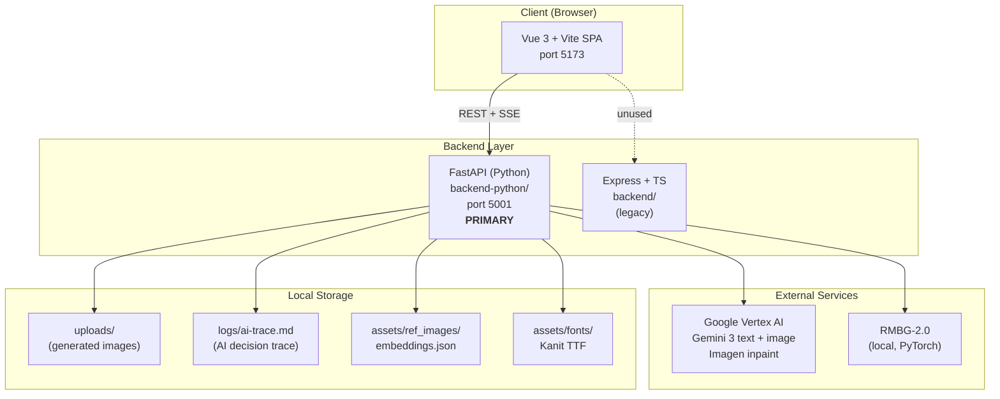
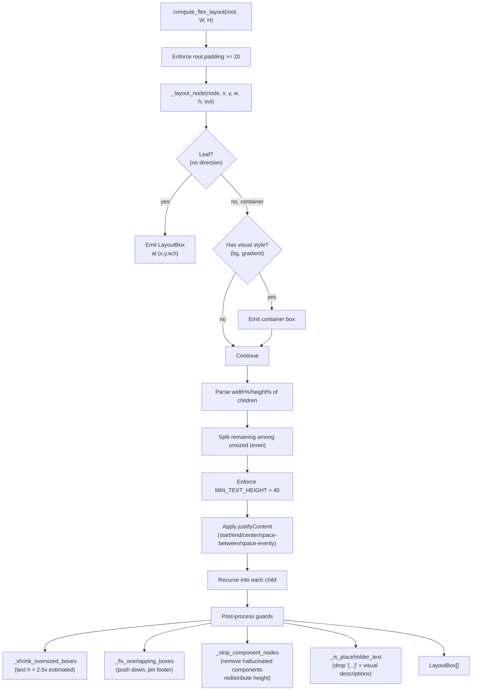
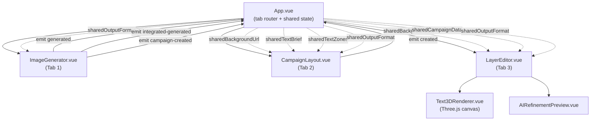
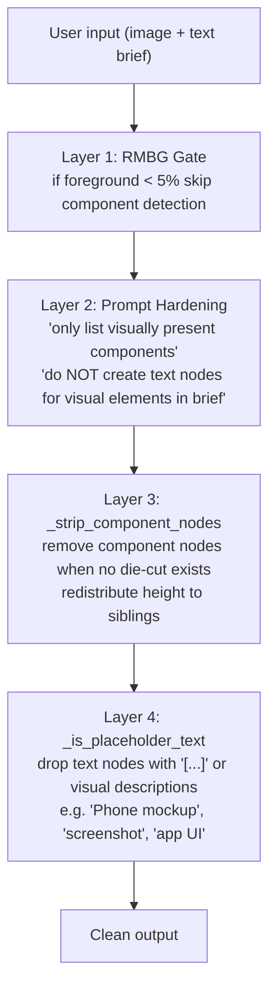
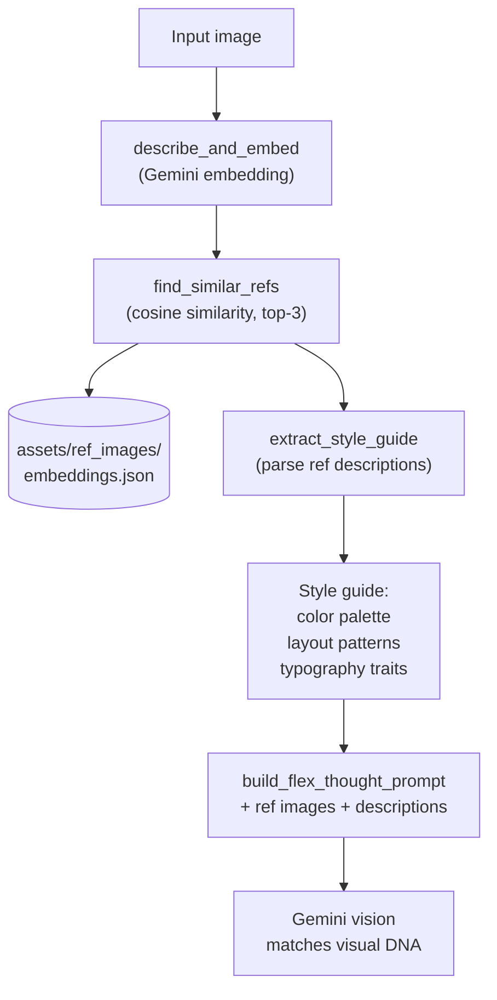

# Architecture — gen-image-layer-separator

Detailed reference covering the system overview, file layout, and every workflow.
Use this as the onboarding / debugging / extension guide.

---

## 1. High-Level Overview

An **AI-powered image layer separator + ad campaign generator**.
Google Vertex AI (Gemini 3) is the AI core, RMBG-2.0 handles background removal,
and the main pipeline streams results over SSE (Server-Sent Events).



**Key boundaries**
- Frontend never calls Vertex directly — every AI call goes through FastAPI.
- RMBG runs in-process (singleton, warmed up on startup).
- `backend/` (Express) is legacy; all new work lives in `backend-python/`.

---

## 2. Module Map

```mermaid
graph TB
  Root["gen-image-layer-separator/"]
  Root --> FE["frontend/"]
  Root --> BP["backend-python/"]
  Root --> B["backend/ (legacy)"]

  FE --> FEApp["src/App.vue<br/>(tab router + shared state)"]
  FE --> FECmp["src/components/"]
  FECmp --> FEIG["ImageGenerator.vue"]
  FECmp --> FECL["CampaignLayout.vue"]
  FECmp --> FELE["LayerEditor.vue"]
  FECmp --> FE3D["Text3DRenderer.vue"]

  BP --> BPApp["app/"]
  BPApp --> BPMain["main.py (FastAPI entry)"]
  BPApp --> BPRt["routes/image.py"]
  BPApp --> BPCtl["controllers/image.py<br/>(SSE orchestration)"]
  BPApp --> BPSvc["services/vertex.py<br/>(AI client)"]
  BPApp --> BPPr["prompts/<br/>(AI prompt templates)"]
  BPApp --> BPUt["utils/<br/>(flex, svg, text, contrast)"]
  BPApp --> BPCo["constants/<br/>(pipeline, models)"]

  BPPr --> P1["campaign_layout.py"]
  BPPr --> P2["flex_layout.py"]
  BPPr --> P3["critique.py"]
  BPPr --> P4["diecut.py"]
  BPPr --> P5["layout_strategy.py"]
  BPPr --> P6["render_campaign.py"]
  BPPr --> P7["separate_layers.py"]
  BPPr --> P8["describe.py"]
  BPPr --> P9["text_zone_planner.py"]

  BPUt --> U1["flex_layout.py<br/>(tree to boxes)"]
  BPUt --> U2["svg_builder.py<br/>(boxes to SVG)"]
  BPUt --> U3["text_measure.py"]
  BPUt --> U4["text_warp.py"]
  BPUt --> U5["safe_zones.py"]
  BPUt --> U6["ref_image_search.py"]
  BPUt --> U7["contrast.py"]
  BPUt --> U8["brightness_map.py"]
  BPUt --> U9["ai_logger.py"]
```



---

## 3. API Surface

Endpoints are registered in `backend-python/app/routes/image.py`
and implemented in `backend-python/app/controllers/image.py`.

### 3.1 REST Endpoints

| Method | Path | Purpose | Key Output |
|---|---|---|---|
| POST | `/process` | Analyze components + separate text layers from an image | `{ textLayers, visualComponents, backgroundDescription }` |
| POST | `/generate` | Text-to-image (Imagen), optional reference images | `{ imageUrl, text, prompt, layers }` |
| POST | `/add-text` | Suggest campaign layout (no render) | `{ suggestions, components, ... }` |
| POST | `/render-text` | Composite text suggestions onto an image | `{ imageUrl }` |
| POST | `/generate-integrated` | Plan text zones + generate background (integrated flow) | `{ imageUrl, textZones, bgConstraints }` |
| POST | `/warp-preview` | Preview a text warp effect | `{ svg, width, height }` |
| POST | `/export-svg` | Export SVG: embed fonts or convert to paths | SVG file |

### 3.2 SSE Endpoints (streaming)

| Method | Path | Purpose |
|---|---|---|
| POST | `/create-campaign` | Full pipeline from a user-uploaded image |
| POST | `/create-campaign-integrated` | Full pipeline with background generated from a text brief |

SSE events emitted (details in section 5):
`progress`, `inpaint_mask`, `inpaint_iteration`, `background_ready`,
`debug`, `debug_preview`, `iteration_start`, `iteration_end`,
`critique_complete`, `refining`, `done`, `error`.

---

## 4. Backend Module Responsibilities

### 4.1 `services/vertex.py` — AI client layer

| Method | Purpose |
|---|---|
| `generate_image()` | Text-to-image via Imagen (optional ref images) |
| `render_campaign_image()` | Composite text suggestions onto an image |
| `plan_layout_strategy()` | Plan layout concept + component positions |
| `suggest_campaign_layout()` | Analyze image, detect components, suggest placement |
| `critique_layout()` | AI Art Director judge (PASS/FAIL + actionable steps) |
| `separate_layers()` | Detect text layers in an image |
| `analyze_components()` | Detect visual components (characters, props) |
| `generate_diecut_components()` | Generate isolated cutout of each component |
| `inpaint_background()` | Remove foreground + inpaint background (Imagen) |
| `run_rmbg_and_get_bboxes()` | RMBG-2.0 → alpha mask + foreground bboxes |
| `extract_component_stroke_bboxes()` | Safe zones around die-cuts (for text avoidance) |
| `export_svg()` | Embed fonts / convert to paths |
| `suggest_flex_layout()` | Generate flex tree (two-stage: thought → tree) |
| `describe_and_embed()` | Generate description + embedding for ref search |
| `plan_text_zones()` | Plan pre-validated zones (integrated flow) |

Every call is wrapped in `with_retry()` (3 retries, exp backoff from 2s, handles 429 + timeout).

### 4.2 `prompts/` — AI prompt templates

Rules (per CLAUDE.md):
- **Always generic** — never include image-specific content (e.g. "port scene", "purple padlock").
- **Universal rules** — rules must be design principles applicable to any image.
- **AI must decide** — no lookup tables (e.g. "asphalt is dark").

| File | Exports |
|---|---|
| `campaign_layout.py` | `build_campaign_layout_prompt(target_text, ...)` |
| `flex_layout.py` | `build_flex_thought_prompt(...)`, `build_flex_tree_prompt(...)` |
| `critique.py` | `build_critique_prompt(target_text, ...)` |
| `diecut.py` | `build_diecut_prompt(label, description, is_character)` |
| `layout_strategy.py` | `build_layout_strategy_prompt(...)` |
| `render_campaign.py` | `build_render_prompt(...)` |
| `separate_layers.py` | `build_separate_layers_prompt(...)`, `build_analyze_components_prompt()` |
| `describe.py` | `DESCRIBE_PROMPT` |
| `text_zone_planner.py` | `build_text_zone_prompt(...)` |

### 4.3 `utils/` — Pure logic helpers

| File | Key API | Purpose |
|---|---|---|
| `flex_layout.py` | `compute_flex_layout(tree, canvas_w, canvas_h)` | Convert flex tree (AI output) → `LayoutBox[]` with absolute pixel coords |
| `svg_builder.py` | `build_flex_svg(FlexSVGInput)` | Render boxes → SVG (Kanit embedded, effects) |
| `text_measure.py` | `measure_text()`, `wrap_text()`, `auto_fit_font_size()` | Pillow-based font metrics |
| `text_warp.py` | `render_warped_text(text, warp_config, ...)` | Arc/wave/bulge/flag warp (glyph path transform) |
| `safe_zones.py` | `compute_safe_zones(obstacles)` | Text-safe regions (avoid component bboxes) |
| `ref_image_search.py` | `find_similar_refs()`, `extract_style_guide()` | Cosine similarity + style extraction |
| `contrast.py` | `check_text_contrast(image, boxes)` | WCAG AA 4.5:1 compliance check |
| `brightness_map.py` | Brightness heatmap (dark→bright) | Visual debug for text placement |
| `ai_logger.py` | `log_event()`, `trace_ai()` | Append to `logs/ai-trace.md` |

### 4.4 `constants/` — Tunable values (no magic numbers in logic)

**`pipeline.py`** centralises every threshold used by the pipeline:
- Image sizing: `PROCESSING_MAX_W=1500`, `STRATEGY_RESIZE_W=800`, `FULL_BG_MAX_DIM=1500`
- RMBG: `RMBG_MODEL_SIZE=1024`
- Die-cut: `DIECUT_MIN_DIM=40`, `DIECUT_MIN_OPAQUE_RATIO=0.05`, `DIECUT_CHAR_PAD=0.1`
- Alpha thresholds: `FG_DETECT_ALPHA_THRESH=20`, `FG_DETECT_RATIO_THRESH=0.05`, `INPAINT_FG_ALPHA_THRESH=30`, `BBOX_ALPHA_THRESH=50`
- Keyword lists: `CHARACTER_KEYWORDS`, `PROP_KEYWORDS`, `GRAPHICAL_KEYWORDS`
- Regex: `PROMO_RE_PATTERN` (matches "%", "×", Thai numerals, "ต่อ", ...)

**`models.py`**:
- `SAFETY_OFF` — Gemini safety (all categories OFF)
- `get_text_model()`, `get_text_model_best()` — read endpoints from env

---

## 5. Create-Campaign Pipeline (Core Workflow)

This is the main workflow of the system, streaming via SSE.
Source: `backend-python/app/controllers/image.py`, lines 1035–1381.

### 5.1 Pipeline Graph

```mermaid
graph TB
  Start(["POST /create-campaign<br/>image + text + noGoZones"]) --> S1A

  subgraph Phase1["Phase 1: Understand Image"]
    S1A["Step 1A: RMBG Prescan<br/>_step_rmbg_prescan<br/>RMBG-2.0 local model"]
    S1B["Step 1B: Component Placement<br/>_step_component_placement<br/>Gemini vision"]
    FGGate{"Foreground<br/>opaque &gt; 5%?"}

    S1A --> FGGate
    FGGate -- "yes" --> S1B
    FGGate -- "no (BG-only)" --> SkipComp["Skip component<br/>detection"]
  end

  S1B --> S2
  SkipComp --> S2

  subgraph Phase2["Phase 2: Die-cut + Clean BG"]
    S2["Step 2: Die-cut + Inpaint<br/>_step_diecut_and_inpaint"]
    S2D["generate_diecut_components<br/>(Imagen per-component)"]
    S2Q["Quality gate<br/>min 40px, opaque &gt; 5%"]
    S2I["inpaint_background<br/>(Imagen)"]
    S2E["extract_component_stroke_bboxes<br/>(safe zones)"]

    S2 --> S2D --> S2Q --> S2I --> S2E
  end

  S2E --> S3

  subgraph Phase3["Phase 3: Layout + Render"]
    S3["Step 3: Flex Layout<br/>_step_flex_layout"]
    S3R["ref_image_search<br/>find_similar_refs (top-3)"]
    S3G["extract_style_guide"]
    S3A["suggest_flex_layout<br/>thought prompt + tree prompt"]
    S3C["compute_flex_layout<br/>(tree to boxes)"]
    S3S["Strip guards<br/>_strip_component_nodes<br/>_is_placeholder_text"]
    S3V["build_flex_svg<br/>(Kanit embed + effects)"]

    S3 --> S3R --> S3G --> S3A --> S3C --> S3S --> S3V
  end

  S3V --> S4

  subgraph Phase4["Phase 4: Critique Loop"]
    S4["Step 4: Refinement<br/>_step_refinement_loop<br/>(max_iter=1)"]
    S4P["Composite preview<br/>(cairosvg)"]
    S4CT["check_text_contrast<br/>(WCAG AA)"]
    S4CR["critique_layout<br/>(AI Art Director)"]
    Dec{"status PASS<br/>or max_iter?"}
    S4RF["Refine: feed feedback<br/>to suggest_flex_layout<br/>recompute + rebuild SVG"]

    S4 --> S4P --> S4CT --> S4CR --> Dec
    Dec -- "no" --> S4RF --> S4P
    Dec -- "yes" --> Done
  end

  Done(["SSE: done event<br/>svg_overlay + flexTree<br/>+ computedBoxes<br/>+ visualComponents<br/>+ critique data"])
```



### 5.2 Step-by-Step Detail

**Step 1A — `_step_rmbg_prescan` (controllers/image.py:514)**
- In: `image_bytes`
- Calls: `vertex.run_rmbg_and_get_bboxes(image_bytes)`
- Out: `masked_buf` (PNG+alpha), `no_go_zones` (bbox list)
- SSE: `progress { step: "rmbg_analysis" }`
- **Gate**: `_has_extractable_foreground()` checks whether the alpha opaque ratio ≥ `FG_DETECT_RATIO_THRESH` (0.05). If below that threshold, the image is treated as BG-only and steps 1B / 2 are skipped.

**Step 1B — `_step_component_placement` (:538)**
- In: `image_bytes`, `mime`, `text`, `no_go_zones`
- Calls: `vertex.suggest_campaign_layout(..., mode="only_bg_comp", no_go_zones)`
- Out: `analysis = { background_description, campaign_vibe, composition_text_zone, spatial_analysis, suggestions, components }`
- SSE: `progress { step: "initial_analysis" }`

**Step 2 — `_step_diecut_and_inpaint` (:553)**
Two sub-steps:
- **Die-cut**: `vertex.generate_diecut_components(...)` calls Imagen per-component using `build_diecut_prompt(label, description, is_character)` → cutout on a white background.
  - Quality gate: drop if < 40px or opaque < 5%.
  - SSE: `progress { step: "diecut_generation" | "diecut_complete" }`
- **Inpaint**: `vertex.inpaint_background(current_source, full_mask, analysis, callback)` → Imagen cleans the background.
  - SSE: `inpaint_mask { imageBase64 }`, `inpaint_iteration { iteration, totalIterations, previewUrl }`, `background_ready { previewUrl }`
- Out: `visual_components[]`, `generated_bg_url`, `stack_urls[]`, `stroke_bboxes`

**Step 3 — `_step_flex_layout` (:713)**
- Pre-step: `ref_image_search.find_similar_refs(embedding, k=3)` + `extract_style_guide(refs)` inject style DNA into the prompt.
- Calls: `vertex.suggest_flex_layout(image, mime, target_text, component_labels, canvas_size, ref_image_buffers, footer_text, ref_descriptions, style_guide, layout_strategy, no_go_zones, image_description, zone_hints, output_format)`.
  Internally two AI calls: `build_flex_thought_prompt` (reasoning) → `build_flex_tree_prompt` (structured JSON).
- Transform: `compute_flex_layout(flex_tree, canvas_w, content_h)` → `LayoutBox[]`.
- Footer: if `footer_text` is provided, append a footer box + auto `linear-fade bottom rgba(0,0,0,0.7) 15%`.
- Render: `build_flex_svg(FlexSVGInput(...))` → SVG string.
- Out: `svg_overlay`, `flex_result { layoutThought, flexTree, backgroundEffects, ... }`, `computed_boxes`, `flex_boxes`.
- SSE: `progress { step: "text_layout" }`, `debug { step: "flex_layout", flexTree, boxes }`.

**Step 4 — `_step_refinement_loop` (:849)**
Loop up to `max_iter` iterations (default 1):
1. Composite SVG onto the original image via cairosvg → preview bytes.
   - SSE: `iteration_start { iteration, maxIterations }`, `debug_preview { previewUrl }`.
2. `contrast.check_text_contrast(image, text_boxes)` → WCAG AA 4.5:1 check per box.
3. `vertex.critique_layout(image, preview, mime, target_text, style_only=False, has_components, style_guide, layout_thought, contrast_data)` → `{ status, confidence, feedback, actionable_steps }`.
   - SSE: `critique_complete { iteration, status, confidence, feedback, actionableSteps }`.
4. If `PASS` or `iter == max_iter` → break.
5. If `FAIL` → build `refined_text = target_text + "[REFINEMENT FEEDBACK]\n" + feedback + actionable_steps` → call `suggest_flex_layout` + `compute_flex_layout` + `build_flex_svg` again.
   - SSE: `refining`, `iteration_end { svg_overlay, flexTree, canvasSize, ... }`.

**Final `done` event payload**:
```json
{
  "success": true,
  "data": {
    "referenceImage": "/uploads/...",
    "backgroundDescription": "...",
    "generatedBackgroundImageUrl": "...",
    "campaignVibe": "...",
    "svg_overlay": "<svg>...</svg>",
    "flexTree": {...},
    "computedBoxes": [{"id","type","x","y","w","h","text","style",...}],
    "canvasSize": {"w","h"},
    "textLayers": [{"text","position","style"}],
    "visualComponents": [{"label","imageUrl","position","z_index"}],
    "stackImageUrls": ["..."],
    "critiqueIterations": 1,
    "finalCritiqueStatus": "PASS",
    "finalCritiqueFeedback": "...",
    "backgroundEffects": [{"type":"linear-fade","from":"bottom",...}],
    "outputFormat": "standard"
  }
}
```

---

## 6. Flex Layout Engine

Source: `backend-python/app/utils/flex_layout.py:174-349`.

### 6.1 Concept

The AI decides what the layout should look like and emits a **flex tree** (similar to a CSS flexbox tree).
Code then converts that tree into **absolute box coordinates**.

**Why a flex tree instead of absolute coords**: the AI reasons relationally ("body sits under headline, full width") far better than in raw pixels, and this mirrors the way real designers think (split the canvas into sections, then fill each one).

### 6.2 Input / Output Shape

```typescript
// INPUT (from AI)
interface FlexNode {
  id: string
  direction: "row" | "column" | null     // null = leaf
  children: FlexNode[] | null
  type: "text" | "component" | null
  text?: string; label?: string
  width?: string                          // "50%" | "300px"
  height?: string
  style?: FlexNodeStyle                   // fontSize, color, stroke, warp, ...
  gap?: int; padding?: int
  justifyContent?: "start"|"end"|"center"|"space-between"|"space-evenly"
  alignItems?: "start"|"end"|"center"|"stretch"
}

// OUTPUT
interface LayoutBox {
  id: string
  type: "text"|"component"|"container"
  x: float; y: float; w: float; h: float  // absolute pixels
  text?: string; label?: string
  style?: FlexNodeStyle
}
```

### 6.3 Algorithm



**Guards (hallucination defense layer)** — see section 9.

---

## 7. SVG Builder

Source: `backend-python/app/utils/svg_builder.py:530-640`.
Entry: `build_flex_svg(FlexSVGInput) -> FlexSVGResult`.

### 7.1 Node Types Handled

| Type | Renders | Features |
|---|---|---|
| `text` | `<text>` or warp paths | Kanit font (base64 embed), fill, stroke, textShadow (feDropShadow), skewX/Y, perspective, rotateX/Y, warp (arc/wave/bulge/flag), 3D (handled by frontend), clipPath guard |
| `component` | `<image>` | Auto drop-shadow filter, `preserveAspectRatio="xMidYMid meet"` |
| `container` | `<rect>` | backgroundColor + opacity, borderRadius (auto for CTA) |

### 7.2 Font Embedding

Load Kanit TTF files from `backend-python/assets/fonts/`:
- `Kanit-Regular.ttf` (400), `Kanit-Bold.ttf` (700), `Kanit-Black.ttf` (900).

Each font is base64-encoded and inlined into `<defs><style>` as `@font-face` rules.
This is what lets cairosvg render Thai text correctly — without the embed, Thai characters fall back to `[]` boxes.

### 7.3 Background Effects (canvas-level)

| Type | Output |
|---|---|
| `linear-fade` | `<linearGradient>` + rect, direction top/bottom/left/right, size (%) |
| `radial-fade` | `<radialGradient>` + rect |
| `vignette` | Edge darkening |

Box-level gradients go through `style.gradientOverlay`, e.g. `"to-bottom rgba(0,0,0,0) rgba(0,0,0,0.7)"`.

### 7.4 3D Text

Props `text3dStyle` (extruded / embossed / floating / neon), `text3dDepth`, `text3dBevel`, `text3dMaterial`, `text3dLightAngle`, `text3dColor`, `text3dSideColor` are **not** rendered in the SVG itself — they are passed to the frontend `Text3DRenderer.vue` (Three.js).

---

## 8. Frontend Architecture

### 8.1 Component Tree + State Flow



### 8.2 Tab Responsibilities

**Tab 1 — ImageGenerator.vue**
- Three modes:
  - `normal` → `POST /generate`
  - `integrated` → `POST /generate-integrated`
  - `full-campaign` → `POST /create-campaign-integrated` (SSE)
- Emits: `generated`, `integrated-generated`, `campaign-created`, `proceed`.

**Tab 2 — CampaignLayout.vue**
- Upload image + text brief → `POST /create-campaign` (SSE).
- Listens to: `progress`, `iteration_end`, `critique_complete`, `done`.
- State: `analysis` (campaign data), `flexTextNodes` (computed from flexTree).
- Emits: `created`, `proceed`.

**Tab 3 — LayerEditor.vue**
- Canvas editor + 3D text + warp preview.
- Watch `props.campaignData` → extract layers, background, svg_overlay.
- `POST /render-text` → simple / AI composite.
- `POST /export-svg` → embed-fonts / paths mode.
- Sanitize SVG with DOMPurify before rendering.

### 8.3 Shared State Map

| Key | Writer | Reader | Purpose |
|---|---|---|---|
| `sharedBackgroundUrl` | Tab 1 | Tab 2, Tab 3 | Generated / reference image URL |
| `sharedCampaignData` | Tab 2 | Tab 3 | Full campaign (flexTree, svg, components) |
| `sharedTextBrief` | Tab 1 | Tab 2 | Campaign copy |
| `sharedTextZones` | Tab 1 (integrated mode) | Tab 2 | Pre-planned text zones |
| `sharedOutputFormat` | Global | All tabs | `"standard"` \| `"psd"` \| `"3d"` |

---

## 9. Design Principles & Guardrails

### 9.1 No Post-Processing Hotfixes on AI Output

Do **not** write code that "fixes" AI output after the fact (clamping, normalizing, scaling, forcing bounds).
If the output is wrong, fix the **input** (prompt, pipeline data, canvas dimensions).

**Why**: hotfixes produce ugly results (clipped / overlapping / squashed elements) and mask real bugs.

### 9.2 No Image-Specific Hardcoding in Prompts

Examples and rules must be **universal** — valid for any image.
Never include image-specific content (e.g. "purple padlock", "port scene").
If the AI needs image-specific context, pass it through pipeline data (image_description, layout_strategy, no_go_zones) — do not hardcode it.

### 9.3 Rules Must Be Universal Design Principles

✅ "Observe the actual brightness of the area before classifying light vs dark" (teaches reasoning).
❌ "Asphalt is always dark" (lookup table — does not generalize to beach, forest, etc.).

### 9.4 Hallucination Defense — 4 layers



### 9.5 Reference Style Intelligence



### 9.6 Critique Gating

`critique.py` is conditional: when there are **no** die-cut components, the critique prompt instructs the AI **not** to FAIL for missing visual elements (logo, phone mockup, etc.) and to judge **only** text readability, contrast, and hierarchy.

### 9.7 Thai Text Rendering

Kanit fonts are base64-embedded in **two places** (intentional duplication):
1. `vertex.generate_layout_preview()`
2. `svg_builder.build_flex_svg()`

Forgetting the embed means cairosvg renders Thai as `[]` boxes, which breaks the AI critique loop.

### 9.8 Error Handling

`vertex.with_retry()` wraps every AI call: 3 retries, exponential backoff (starting at 2s), handles 429 + timeout.

---

## 10. Debugging & Observability

### 10.1 AI Trace Log

Every AI call (layout reasoning, critique, diecut, etc.) is logged to `backend-python/logs/ai-trace.md`
with the full prompt + raw response + timestamp.

Search for **"Flex Layout Thought"** entries to see the AI's reasoning before it generates the tree.

### 10.2 SSE Event Stream

Frontend listeners can debug the pipeline in real time via events:
- `progress` — step markers
- `debug`, `debug_preview` — intermediate data
- `critique_complete` — AI judgment per iteration
- `done` / `error` — terminal

### 10.3 Pipeline Breakpoints

| Symptom | Where to look |
|---|---|
| Components missing / extra | Step 1B `suggest_campaign_layout` + Step 2 die-cut quality gate |
| Overlapping / overflowing text | Step 3 `compute_flex_layout` guards, ai-trace Flex Layout Thought |
| Thai renders as `[]` | `svg_builder.py` font embedding |
| Contrast failures | `utils/contrast.py` + refinement loop iteration 2 |
| Dirty background | Step 2 `inpaint_background` + `inpaint_iteration` SSE events |
| Style not matching refs | `ref_image_search.extract_style_guide` + flex prompt |

---

## 11. Development & Deployment

### 11.1 Dev Server

```bash
cd backend-python
source venv/bin/activate
python -m uvicorn app.main:app --reload --port 5001

cd ../frontend
npm run dev  # port 5173
```

### 11.2 Tests

```bash
cd backend-python
python -m pytest tests/ -v
```

### 11.3 Environment Variables

```
PORT=5001
GOOGLE_SERVICE_ACCOUNT_TYPE=service_account
GOOGLE_SERVICE_ACCOUNT_PROJECT_ID=...
GOOGLE_SERVICE_ACCOUNT_PRIVATE_KEY_ID=...
GOOGLE_SERVICE_ACCOUNT_PRIVATE_KEY=...          # escaped \\n
GOOGLE_SERVICE_ACCOUNT_CLIENT_EMAIL=...
GOOGLE_SERVICE_ACCOUNT_CLIENT_ID=...
GOOGLE_CLOUD_LOCATION=global                    # required for Gemini 3 preview

GEMINI_IMAGE_ENDPOINT=gemini-3.1-flash-image-preview
GEMINI_IMAGE_ENDPOINT_2=gemini-3-pro-image-preview
GEMINI_IMAGE_ENDPOINT_3=gemini-2.5-flash-image
GEMINI_TEXT_ENDPOINT=gemini-2.5-pro
IMAGEN_EDIT_ENDPOINT=imagen-3.0-capability-001
```

**Important**: `GOOGLE_CLOUD_LOCATION=global` is required for Gemini 3 preview — any other region returns 404.

---

## 12. Technical Notes

### Gemini Model Fallback
`generate_image()` fallback chain: `GEMINI_IMAGE_ENDPOINT` (3.1-flash) → `GEMINI_IMAGE_ENDPOINT_2` (3-pro) → `GEMINI_IMAGE_ENDPOINT_3` (2.5-flash).

### RMBG-2.0
- Model is loaded once at FastAPI startup (lifespan hook).
- Runs on CPU or MPS/CUDA depending on availability.
- Input is resized to `RMBG_MODEL_SIZE=1024` before inference.

### Flex Tree Robustness
The AI sometimes returns `gap` / `padding` as strings, dicts, or ints — `_safe_int()` in `flex_layout.py` handles every case.

### Footer Text
- **Code-controlled, not AI** — reserves the bottom 10% of the canvas.
- The AI only sees the content area (`canvas_h - footer_height`).
- Auto-appends `linear-fade bottom rgba(0,0,0,0.7) 15%` so the footer stays readable.

---

**End of document**
