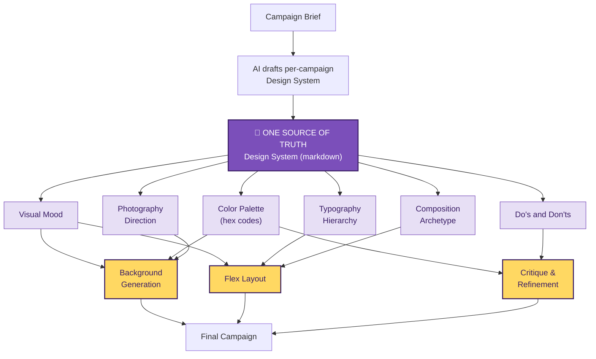

# Pitch Slides — Screenshot Assets

---

## Slide 3 — The Shift

**Title:** From templates to a Design System

**Subtitle:** One document per campaign. Drafted by AI. Readable by humans. Editable.



> **Edit the spec → rerun. No prompt edits. No code changes.**

---

## Slide 4 — Bonus Solve

**Title:** Flex layout, not pixel coordinates

**Subtitle:** Solving a known LLM weakness by changing the question.

### The LLM question

> *"Where does the headline go?"*

### Two ways to answer it

| Pixel approach | Layout approach (ours) |
|---|---|
| `{ x: 48, y: 72, w: 640, h: 56 }` | *"headline on top band,"*<br/>*"card on left half,"*<br/>*"CTA bottom-right"* |
| ❌ Hallucinated numbers | ✅ Reasoning LLMs do well |
| ❌ Inconsistent spacing | ✅ AI outputs a **flex tree** |
| ❌ Off-canvas elements | ✅ Code converts to **exact pixels** |

### The separation of concerns

```
┌──────────────────────────┐         ┌──────────────────────────┐
│   AI (LLM)               │         │   Code (deterministic)    │
├──────────────────────────┤         ├──────────────────────────┤
│                          │         │                          │
│   Creative thinking      │  ─────▶ │   Math                   │
│   Layout reasoning       │         │   Pixel calculation      │
│   Composition choices    │         │   Canvas-aware output    │
│                          │         │                          │
└──────────────────────────┘         └──────────────────────────┘
       its real strength                 its real strength
```

> **AI thinks in layout. Code thinks in pixels.**
> **Each does what it's best at.**

---

## Presenter notes

### Slide 3
- Highlight the **single purple "Design System" node** — it's the whole point
- Trace 2-3 arrows with your finger: "this field feeds this stage"
- End with the underlined line: *"Edit the spec → rerun"*

### Slide 4
- Read both columns of the table aloud — the contrast IS the message
- Pause before "each does what it's best at"
- Skip this slide if time is tight (narrative holds without it)
