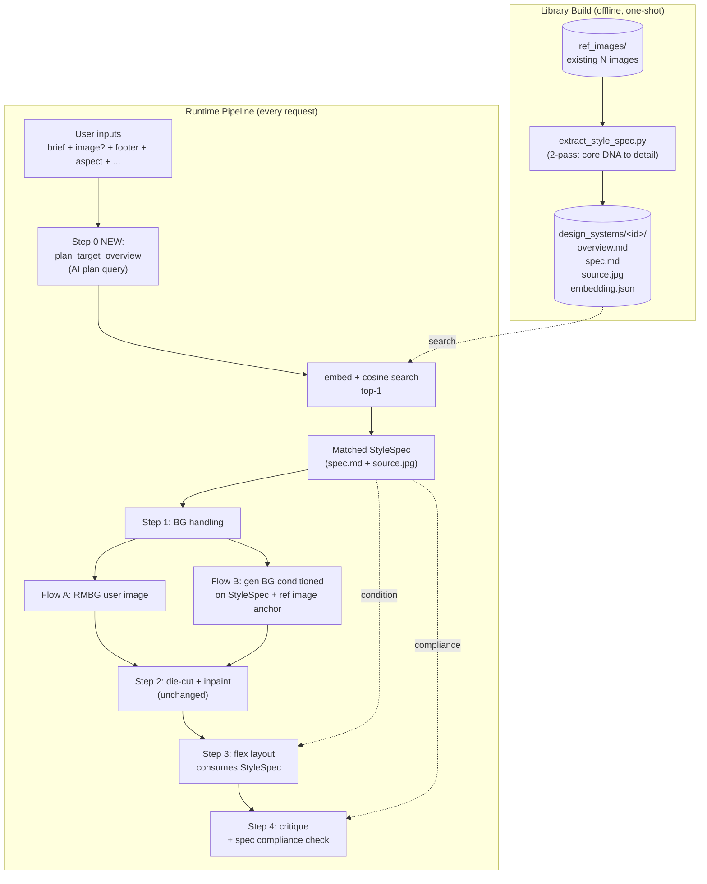
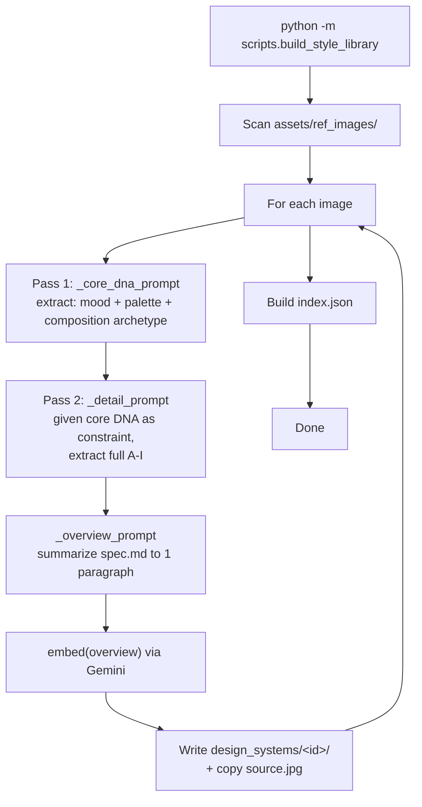

# StyleSpec Pipeline — Design Spec

Date: 2026-04-20
Status: Draft — awaiting implementation plan
Scope: `backend-python/` + minor `frontend/` SSE handler updates

---

## 0. Background & Motivation

This project (gen-image-layer-separator) is a slice extracted from a larger product
whose long-term goal is **dynamic, data-driven ad generation with a conversion
feedback loop**. In that larger vision, each ad is tracked (conversion, persona fit,
why viewers disengage), and the system adjusts future ads based on findings.

The pre-existing approach in the larger product was **hard-coded templates** —
generate an image, place text on a rigid template. That is brittle: each improvement
requires editing assets, and there is no single unit of style that analytics can
attribute outcomes to.

**Why StyleSpec is a better foundation** (even though the feedback loop itself is
explicitly out of scope here):

1. **Editable = tunable by analytics.** A finding like "too dark → 30% bounce on
   persona A" maps to a concrete field (`Color Story: dominant`) whose edit
   affects every future ad.
2. **Per-field diagnosis.** Persona/conversion analysis can attribute outcomes
   to spec fields instead of opaque image features.
3. **Dynamic variety.** Specs are generated per-request from inputs; the
   library grows organically and is not capped like a template set.
4. **Debuggable by humans.** A spec is plain markdown — a non-engineer can read
   it and understand why an ad looks the way it does.

**In-scope here**: replacing the current dumb-image reference mechanism with a
StyleSpec-driven pipeline, and wiring it into both layout and image generation.

**Out-of-scope here**: the conversion feedback loop itself, persona modeling,
A/B routing, analytics integration. The StyleSpec design must simply be
**compatible** with those future additions.

---

## 1. Problem With Current System

Current flow (from `architecture.md`):

- `ref_image_search.find_similar_refs()` does cosine search over
  `assets/ref_images/embeddings.json` to return top-3 reference ads.
- `extract_style_guide()` parses their textual descriptions into an ad-hoc
  string of style cues.
- `suggest_flex_layout()` feeds raw ref images + descriptions + style-guide
  string to Gemini as context.
- Background generation (`generate_image`) is **not** style-conditioned at all —
  it runs on the raw text brief.

Observed weaknesses:

- Feeding raw images gives the model a visual hint but no structured rules to
  follow. Output style drifts.
- No coherence link between background generation and layout: the BG is a
  product of the brief, the layout is a product of the ref images. They don't
  speak the same style language.
- Not editable: to nudge the system, you have to change the ref library.
- Not explainable: no artifact a human can read to predict output style.

---

## 2. Design Decisions (Locked)

All confirmed in brainstorming:

| Decision | Choice |
|---|---|
| Scope | Subsystem swap (keep pipeline core, replace style-conditioning layer) |
| Top-k blending | Skip for v1 — always top-1 |
| Spec schema | Sections A–I: Mood / Color / Typography / Composition / Scene / Subject / Text-Image / Effects / Do's & Don'ts |
| StyleSpec chosen when | Step 0, before any other pipeline step, from **all** inputs |
| Matching basis | AI-planned natural-language "target overview" paragraph → embed → cosine vs library overviews |
| Fallback when match is poor | None — always use top-1 |
| Library source | Existing `assets/ref_images/` |
| Extraction mode | Fully automated (v1) |
| Extraction technique | Two-pass: core DNA → detail consistent with core |
| Storage per entry | `overview.md` (embedded) + `spec.md` (full) + `source.jpg` + `embedding.json` |
| Image gen integration | Hybrid: AI translates spec → Imagen prompt **plus** the matched entry's source image as ref anchor |
| Layout integration | Pass full `spec.md` + anchor image (+ user image in Flow A) |
| Critique integration | Keep readability/contrast checks, add `spec_compliance` check |
| User ref image (Flow A) | Influences Step 0 planning only; library spec remains source of style truth |

---

## 3. Architecture Overview



**Boundary summary**

| Subsystem | Status |
|---|---|
| NEW | Library layout, extraction script, Step 0 (plan + search), Imagen-with-spec path (Flow B) |
| REWRITE (prompts) | `suggest_flex_layout`, `critique_layout`, `campaign_layout` |
| REMOVE | `ref_image_search.find_similar_refs`, `extract_style_guide`, old `embeddings.json` |
| UNCHANGED | RMBG, die-cut, inpaint, `compute_flex_layout`, `build_flex_svg`, SSE orchestrator, frontend core |

---

## 4. Data Model

### 4.1 Library Layout

```
backend-python/assets/design_systems/
  <id>/
    overview.md       # 150-300 words, embeddable, semantic
    spec.md           # full A-I sections, detailed
    source.jpg        # original ref image, kept for visual anchor
    embedding.json    # { vector: [...], model: "gemini-embedding-001" }
  <id>/...
  index.json          # { entries: [{id, overview_preview, vector}] }
```

`index.json` is loaded once at startup into an in-memory structure. N is expected to be ~hundreds.

### 4.2 `spec.md` Schema (A–I Sections)

```markdown
# <Spec Name>

## A. Visual Mood
mood_keywords, energy_level, atmosphere (1 paragraph).

## B. Color Story
dominant / accent / text_primary / text_secondary / shadow / highlight
palette_relationship: complementary | analogous | monochromatic | ...

## C. Typography Personality
font_character: serif | sans | display | script | mixed
weight_hierarchy, tracking_behavior, text_treatments (stroke/shadow/gradient)

## D. Composition Archetype
focal_pattern: centered | rule-of-thirds | diagonal | grid
text_zones, negative_space_ratio, subject_position

## E. Scene / Photo Style
lighting_direction + quality, depth, environment, texture

## F. Subject Treatment
posing, scale, cropping

## G. Text-Image Relationship
pattern: overlay / integrated / banner / caption
contrast_strategy: stroke | shadow | scrim | inherent

## H. Effects Library
gradients, glows, strokes, drop_shadows

## I. Do's and Don'ts
Do: [...]
Don't: [...]
```

### 4.3 `overview.md` Shape

One natural-language paragraph, 150–300 words. Embedding-friendly. Example:

> "A dark editorial luxury aesthetic built on deep burgundy and muted gold.
> Dramatic top-down lighting carves a centered, symmetric subject out of near-black
> negative space. Typography is tight-tracked display serif in cream white,
> overlaid directly onto the scene with subtle drop-shadow for readability.
> Minimalist, serious, premium. No neon, no playful sans-serifs, no flat backgrounds."

Trailing "No X, no Y, no Z" is intentional — it gives negative semantic anchors
that improve discrimination during cosine search.

### 4.4 In-Memory Representation

```python
class StyleSpec:
    id: str
    overview: str                  # raw overview.md
    spec_markdown: str             # raw spec.md
    source_image_path: str         # for visual anchor use
    # optionally parsed (lazy):
    mood_keywords: list[str]
    color_palette: dict[str, str]
    # ...
```

Downstream prompts read `spec_markdown` directly (AI parses it well). Structured
fields are used only where code-level decisions need them (e.g. hex palette
passed explicitly to an Imagen prompt template).

---

## 5. Runtime Pipeline

### 5.1 Step 0 — NEW: Plan + Search

Prepended to both `/create-campaign` (Flow A) and `/create-campaign-integrated` (Flow B).

```
Inputs: { text_brief, user_image?, aspect_ratio, footer_text, output_format }
  → AI: plan_target_overview(inputs) → 150-300 word paragraph
  → embed(paragraph) via Gemini embedding → query_vector
  → cosine_search(query_vector, in-memory index) → top-1 id
  → load StyleSpec from disk
```

SSE events emitted:

```
progress { step: "style_planning",  message: "Analyzing brief..." }
progress { step: "style_selection", message: "Matched: <spec name>" }
debug    { step: "style_spec", overview, source_image_url, spec_id }
```

**Prompt** — `prompts/plan_target_overview.py`:
- Input: brief + user image (if exists) + aspect + hints
- Output: 1 paragraph matching library overview.md shape
- Rule: coherence-first, include negative anchors ("No X, no Y")

### 5.2 Step 1 — Background Handling

**Flow A** (user uploaded image): unchanged — RMBG runs on the user's image.
The matched `source.jpg` is **not** rendered as BG; it serves as a visual anchor
passed into later steps.

**Flow B** (gen BG): `generate_image()` now accepts optional `StyleSpec` + anchor image.
- New helper: `translate_spec_to_imagen_prompt(spec, brief) → str`
- Translates sections A (Mood), B (Color), D (Composition), E (Scene), F (Subject)
  into a single natural-language prompt.
- Sections C (Typography), G (Text-Image), H (Effects), I (Do's/Don'ts) are
  irrelevant to BG generation and excluded.
- Imagen call: prompt + `source.jpg` as reference image.

### 5.3 Step 2 — Die-cut + Inpaint

Unchanged.

### 5.4 Step 3 — Flex Layout (prompt rewrite)

`prompts/flex_layout.py`:

- Old inputs: `ref_image_buffers, ref_descriptions, style_guide_paragraph`
- New inputs: `style_spec.spec_markdown`, `style_spec.source_image_path` (+ user image for Flow A)

The prompt:
- Receives the full `spec.md` verbatim.
- Receives the anchor image as a visual reference.
- Explicitly instructs: "match Typography Personality / Text-Image Relationship / Effects Library sections strictly."
- Two-stage pattern (thought → tree) remains.

### 5.5 Step 4 — Critique (prompt rewrite)

`prompts/critique.py` — extended output:

```json
{
  "status": "PASS" | "FAIL",
  "confidence": 0.0-1.0,
  "feedback": "...",
  "actionable_steps": ["..."],
  "spec_compliance": {
    "pass": true | false,
    "violations": ["Color Story: output uses bright saturated red, spec calls for muted palette", ...]
  }
}
```

A FAIL in either `status` or `spec_compliance.pass` triggers refinement.

### 5.6 Prompts — Touch Map

| File | Action |
|---|---|
| `prompts/plan_target_overview.py` | NEW |
| `prompts/extract_style_spec.py` | NEW (2-pass core + detail) |
| `prompts/translate_spec_to_imagen.py` | NEW |
| `prompts/flex_layout.py` | REWRITE |
| `prompts/critique.py` | REWRITE |
| `prompts/campaign_layout.py` | MINOR (accept style hints) |
| `prompts/describe.py` | KEEP (still used in extraction) |

---

## 6. Module Map

```
backend-python/app/
  controllers/image.py
    - prepend _step_plan_and_match to create-campaign endpoints
    - pass StyleSpec into _step_flex_layout + _step_refinement_loop
    - remove ref_image_search callsites

  services/vertex.py
    - suggest_flex_layout: signature accepts StyleSpec
    - critique_layout: spec_markdown input, spec_compliance output
    - generate_image: optional StyleSpec + anchor image
    - ADD plan_target_overview(inputs) -> str
    - ADD translate_spec_to_imagen_prompt(spec, brief) -> str

  services/style_library.py                 NEW
    - load_index() at lifespan startup
    - in-memory cache
    - search_top_k(query_vector, k=1)

  utils/style_spec.py                       NEW
    - StyleSpec dataclass
    - load_spec(id), parse helpers
  utils/ref_image_search.py                 DELETE

  prompts/
    NEW: plan_target_overview.py
    NEW: extract_style_spec.py
    NEW: translate_spec_to_imagen.py
    REWRITE: flex_layout.py
    REWRITE: critique.py
    MINOR: campaign_layout.py

  constants/pipeline.py
    ADD STYLE_SPEC_DIR = "assets/design_systems"
    ADD STYLE_EMBED_MODEL = "gemini-embedding-001"

backend-python/scripts/
  build_style_library.py                    NEW  (offline one-shot)
  edit_spec.py                              NEW  (optional, re-embed after manual edit)
```

Frontend (`CampaignLayout.vue`): listen for `progress { step: "style_selection" }`
and `debug { step: "style_spec" }`; optionally show a small "Style: <name>" chip.
No breaking changes.

---

## 7. Library Build (Offline)

### 7.1 Flow



### 7.2 Two-Pass Prompt Rationale

**Pass 1 — core DNA** (small, constrained):
```
Look at this ad. Identify in 1-2 sentences:
- mood (3 keywords max)
- palette character (warm/cool/neutral + saturation level)
- composition archetype (centered/thirds/diagonal/grid)

Output JSON: { mood: [...], palette: "...", composition: "..." }
```

**Pass 2 — detail** (receives Pass 1 as hard constraint):
```
The ad has this core DNA: {pass1_json}

Now describe the full design system (sections A-I).
CRITICAL: every section must be consistent with the core DNA.
Do not introduce traits that contradict mood / palette / composition above.
```

Mirrors the existing `flex_layout` thought→tree pattern — proven to gate AI drift.

### 7.3 Cost + Time

Per image: 3 AI calls (core + detail + overview) + 1 embedding call.
At ~50 refs: ~200 calls total, one-time, offline. A few dollars of Gemini usage,
under 10 minutes depending on rate limits.

### 7.4 Idempotency

- Skip if `design_systems/<id>/spec.md` exists and source-image hash matches.
- `--force` rebuilds everything.
- `--only <id>` rebuilds a single entry.
- `index.json` is rebuilt on every run (cheap).

### 7.5 Quality Check

v1 = manual spot-check: user reads 5 random `spec.md` files post-build.
Out-of-scope: automated QA or reviewer loop.

---

## 8. Verification Plan

**Library build**: manual spot-check of 5 random `spec.md` — sections present,
internally coherent, overview reads naturally.

**Search sanity**: unit test that given a known paragraph, top-1 returns
the expected id. Manual check of 3-5 briefs against resulting matches.

**Flow B end-to-end**: same brief through `/create-campaign-integrated` 2–3
times; outputs share visual DNA. Side-by-side vs. pre-change output on 3
representative briefs (subjective judgment).

**Flow A end-to-end**: user image goes through pipeline; layout/typography
respect the matched spec while BG remains the user's image. Existing pytest
suite passes.

**Critique integration**: force a spec violation (wrong color) and verify
`spec_compliance.violations` surfaces it.

**Explicitly not verified in v1** (accepted risks):
- Whether top-1 match quality is actually better than old ref-image approach
  (subjective, needs real-user judgment).
- Scale beyond ~hundreds of ref entries.

---

## 9. Risks & Mitigations

| Risk | Likelihood | Mitigation |
|---|---|---|
| AI-extracted specs are too generic (all look alike) | Medium | Two-pass prompt + trailing "No X, no Y" in overview |
| Extracted specs drift internally incoherent | Medium | Two-pass gate + manual spot-check after build |
| Target overview is vague → bad match | Medium | Prompt demands specific palette/mood/composition, not fluff |
| Imagen ignores structured fields in spec-derived prompt | Medium-high | Hybrid: spec-derived prompt **and** ref anchor image |
| Flex layout prompt bloat | Low | spec.md ~500 words; fits Gemini context easily |
| Library search slow at scale | Very low | In-memory cosine is microseconds for hundreds of entries |
| Re-embedding cost if embedding model changes | Low | Rebuild is cheap (~minutes, one-time) |
| Manual spec.md edit → stale overview/embedding | Medium | `edit_spec.py` CLI re-runs both; document in README |

---

## 10. Out of Scope (v1)

- Top-3 blending (prove top-1 first)
- Human review UI for extraction (CLI only)
- Vector DB (in-memory is fine)
- Spec versioning beyond git history
- Per-user / per-brand libraries
- Realtime spec editing
- Auto-discovery of newly-dropped ref images
- Quality scoring of generated specs
- **Conversion feedback loop, persona analytics, A/B routing** — the larger
  product goal that motivated this design; deliberately excluded here, but
  the StyleSpec artifact is the foundation it will build on.

---

## 11. Success Criteria

Qualitative, judged by user:

1. Flow B background generation on the same brief looks **more consistent**
   run-to-run.
2. Generated layouts **visibly match** the matched spec's typography / effects /
   palette — the style is recognizable.
3. Output **does not clone** any single ref image (spec abstracts the style).
4. The user can read a `spec.md` and understand why the output looks the way
   it does (debuggability — the essential prerequisite for the future feedback
   loop).

No quantitative metric for v1 — all judgment-based.

---

## 12. Future Work (Not v1)

- Top-3 spec blending (original user vision)
- Hybrid extraction with human-edit loop
- Vector DB when library exceeds ~1000
- Per-brand libraries (select subset for matching)
- Auto-critique during library build (reject incoherent specs)
- Embedding fine-tuned on ad-specific vocabulary
- **Conversion feedback loop**: map analytics outcomes back to spec fields;
  automatically propose spec edits per persona/conversion data. This is the
  reason StyleSpec was chosen over template-based or image-based approaches.

---

**End of spec.**
